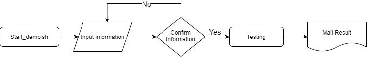

# WIFI_Test


Setup (參考來源連結先安裝好相關套件)
--------------
```shell
apt-get install python-pip curl
pip install -r requirements.txt
```

Flow
-----------------



1. 把相關的testcase 寫好後,修改testsuites.cfg / tests/新增test case
2. 新增start.demo.sh 方便測試人員使用
3. 把待測的設備接上系統,輸入相關資訊,執行測試,測試結束發信至測試人員的mail 

新增功能
-----------------
1.原本並沒有針對webui好用的套件,改用selenium 搭配不同bowser 去做webui的設定

2.新增module ssh / telnet / wifista / wan type 切換 , 測試上可以互相搭配

3.mail repoter 採用 smtp 套件,來做用戶的報告產出


大致上的階層如下
```
my_overlay/
├── devices
│   ├── my_device.py (系統設定)
├── html
│   └── template_results.html (預設的result模板)
├── tests (新增testcases)
│   ├── this.py
│   ├── that.py
│   └── foobar.py
└── testsuites.cfg (testcases name)
```


Reference
-----------------
https://github.com/qca/boardfarm

